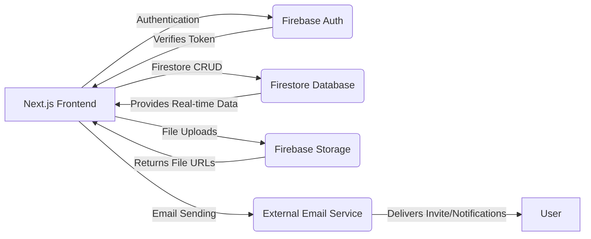
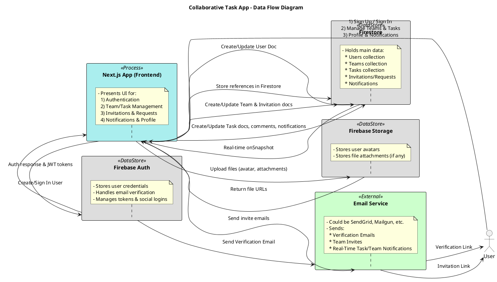

```md
<!-- 
  WELCOME TO THE OFFICIAL README FOR THE COLLABORATIVE TASK MANAGEMENT SYSTEM!
  This file aims to be as comprehensive, stylish, modern, and visually appealing as possible.
  Enjoy the ride!
-->

<div align="center">
  <!-- BANNER OR LOGO -->
  

  <h1 style="color:#4CAF50; font-weight:900; font-size:3rem;">
    Collaborative Task Management System
  </h1>

  <p style="font-size:1.2rem;">
    A modern, full-featured web application for teams to manage tasks, collaborate in real-time, 
    and streamline workflow.
  </p>

  <!-- Badges -->
  <p>
    <a href="https://github.com/YourRepoName/YourProjectName/actions">
      
    </a>
    <a href="https://github.com/YourRepoName/YourProjectName/issues">
      
    </a>
    <a href="LICENSE">
      
    </a>
  </p>

  
  
  
  
</div>

---

## Table of Contents

1. [About the Project](#about-the-project)  
2. [Key Features](#key-features)  
3. [Architecture](#architecture)  
4. [Data Flow Diagram](#data-flow-diagram)  
5. [Getting Started](#getting-started)  
6. [Installation](#installation)  
7. [Usage](#usage)  
8. [Environment Variables](#environment-variables)  
9. [Running the Project](#running-the-project)  
10. [Project Structure](#project-structure)  
11. [Security & Access Control](#security--access-control)  
12. [Roadmap & Future Features](#roadmap--future-features)  
13. [Contributing](#contributing)  
14. [License](#license)  

---

## About the Project

The **Collaborative Task Management System** is a full-stack web application built with **Next.js** (App Router) and **Firebase** (Auth, Firestore, Storage). It is designed to help teams:

- Create, assign, and manage tasks.
- Collaborate via comments and @mentions in real-time.
- Organize their workflow using Kanban boards or table views.
- Invite users and manage teams (both public and private).
- Gain insights with basic analytics (task completion, overdue tasks, etc.).
- Toggle notifications for in-app or email-based alerts.

The app boasts a **modern UI**, responsive design, and is intended to be easily extensible for future features like **AI suggestions**, **calendar integrations**, or an eventual **mobile app**.

---

## Key Features

1. **Authentication**  
   - Email & Password (with **Firebase email verification**)  
   - **Social Logins**: Google, GitHub  
   - Password reset and optional 2FA (future expansion)

2. **User Profiles**  
   - Name & avatar  
   - Notification preferences  
   - Soft-delete account mechanism  

3. **Teams**  
   - Public Teams: Anyone can join freely.  
   - Private Teams: Require admin approval or an invitation to join.  
   - **Invitations**: Expirable links for unregistered users; direct invites for registered users.  
   - **Roles**: Admin and Member  

4. **Task Management**  
   - Kanban board & table views  
   - Multiple assignees, due dates, statuses (Pending, Working, Completed)  
   - **Real-time** updates (Firestore onSnapshot)  
   - **Checklists** within tasks  
   - **Comments** with @mentions  

5. **Analytics & Reporting**  
   - Task completion rates, overdue tasks, time-to-completion  
   - Summaries by team or user  

6. **Notifications**  
   - In-app real-time feed  
   - Email notifications (immediate)  
   - Fine-grained notification settings  

7. **Security**  
   - Firestore security rules for controlled access  
   - Private team membership approval  
   - Soft deletion of user/team data  

---

## Architecture



1. **Next.js App**: Serves the React-based UI (including SSR if desired) and interacts with Firebase.  
2. **Firebase Auth**: Manages user sign up, sign in, social logins, and tokens.  
3. **Firestore**: Stores user profiles, teams, tasks, invitations, comments, etc. in real-time.  
4. **Firebase Storage**: Holds user avatars, task attachments, images, etc.  
5. **External Email Service**: (e.g., SendGrid, Mailgun) used for sending verification, invitations, or notifications.

---

## Data Flow Diagram

Below is the **Data Flow Diagram** (Level 1) illustrating the primary data stores and processes.

<details>
<summary>PlantUML Code</summary>



</details>


---

## Getting Started

To get a local copy up and running, you’ll need:

1. **Node.js** (v16+ recommended)  
2. **npm** or **yarn**  
3. A **Firebase** project (with Firestore, Auth, Storage enabled)  
4. An **External Email Service** API key (optional, if you’re sending invites/notifications beyond Firebase’s built-in email verification)

---

## Installation

1. **Clone the repository**  
   ```bash
   git clone https://github.com/<YourUserName>/<YourRepoName>.git
   cd <YourRepoName>
   ```

2. **Install dependencies**  
   ```bash
   npm install
   ```
   or
   ```bash
   yarn install
   ```

3. **Set up Firebase project**  
   - Go to [Firebase Console](https://console.firebase.google.com/), create a new project.  
   - Enable **Authentication**, **Firestore**, **Storage**.  
   - Set up the **Social Logins** (Google, GitHub) in the Firebase Auth provider settings.

4. **Configure Email Verification**  
   - In Firebase Console’s **Authentication** > **Templates**, customize the verification email if needed.

5. **(Optional) External Email Service**  
   - If you plan on sending custom invites or other transactional emails, sign up with **SendGrid** or **Mailgun**, get an API key.

---

## Usage

Once your environment variables are set (see next section) and you have everything installed:

1. **Development Mode**  
   ```bash
   npm run dev
   ```
   This starts the Next.js server on [http://localhost:3000](http://localhost:3000).

2. **Production Build**  
   ```bash
   npm run build
   npm start
   ```
   This creates an optimized build and starts the server.

---

## Environment Variables

Create a file named `.env.local` in the root folder:

```plaintext
NEXT_PUBLIC_FIREBASE_API_KEY=...
NEXT_PUBLIC_FIREBASE_AUTH_DOMAIN=...
NEXT_PUBLIC_FIREBASE_PROJECT_ID=...
NEXT_PUBLIC_FIREBASE_STORAGE_BUCKET=...
NEXT_PUBLIC_FIREBASE_MESSAGING_SENDER_ID=...
NEXT_PUBLIC_FIREBASE_APP_ID=...
NEXT_PUBLIC_FIREBASE_MEASUREMENT_ID=...

EMAIL_SERVICE_API_KEY=...  # If using an external email service
EMAIL_SERVICE_DOMAIN=...   # For services like Mailgun
SENDGRID_SENDER=...        # Or your chosen email provider
```

> **Note**: The `NEXT_PUBLIC_` prefix is for variables accessed by the frontend. Keep sensitive API keys out of the client if possible (use server functions or Cloud Functions when needed).

---

## Running the Project

1. **Local Development**  
   ```bash
   npm run dev
   ```

2. **Deploy to Vercel**  
   - Sign in to [Vercel](https://vercel.com/).  
   - Import your GitHub repo.  
   - Add **Environment Variables** in the Vercel dashboard.  
   - Deploy!  

3. **Firebase Integration**  
   - Ensure your Firebase config is correct.  
   - Check **Firestore Security Rules** and **Storage Rules**.

---

## Project Structure

```bash
├── src/
│   ├── app/                # Next.js App Router
│   │   ├── layout.tsx      # Main layout
│   │   ├── page.tsx        # Landing/Home page
│   │   ├── signin/         # Sign In page
│   │   ├── signup/         # Sign Up page
│   │   ├── profile/        # Profile & Settings
│   │   ├── teams/          # Teams pages (create, list, details)
│   │   │   └── [teamId]/   # Dynamic routes for team
│   │   ├── tasks/          # Task management
│   │   │   └── ...         # Kanban, table view, etc.
│   ├── components/         # Reusable React components
│   ├── lib/
│   │   ├── firebase.ts     # Firebase initialization
│   │   └── helpers.ts      # Utility functions
│   ├── hooks/              # Custom hooks
│   ├── styles/             # Tailwind CSS or other styles
│   └── types/              # TypeScript type definitions
├── public/                 # Public assets
├── .env.local              # Environment variables (ignored by Git)
├── package.json
├── tailwind.config.js
├── tsconfig.json
└── README.md               # You are here!
```

---

## Security & Access Control

- **Firestore Rules**:  
  1. Only **authenticated & verified** users can read/write certain collections.  
  2. **Teams**: Only members can read. If `privacy === "public"`, minimal info is visible to everyone.  
  3. **Invitations & Requests**: Only team admins can create or accept.  
  4. **Tasks**: Only team members can create/read/update tasks for that team.  
- **Soft Deletion**:  
  - Mark user doc or team doc with a `deleted: true` field, restricting usage in queries.

---

## Roadmap & Future Features

1. **AI Suggestions** (e.g., auto-prioritizing tasks).  
2. **Calendar Integration** (Google Calendar, Outlook).  
3. **Advanced Roles** (manager, observer, etc.).  
4. **Mobile App** with React Native / Flutter.  
5. **Slack or MS Teams Integration** for notifications.  
6. **Daily/Weekly Email Summaries** instead of real-time spam.  
7. **Automatic Time Tracking** with a start/stop timer.  

---

## Contributing

We welcome **pull requests**, **issues**, and **feature suggestions**!

1. **Fork** the project.  
2. Create a new **feature branch**: `git checkout -b feature/amazing-feature`.  
3. Commit your changes: `git commit -m 'Add some amazing feature'`.  
4. **Push** to the branch: `git push origin feature/amazing-feature`.  
5. **Open a Pull Request** explaining your changes.

---

## License

Distributed under the **MIT License**. See [LICENSE](LICENSE) for more information.

---

<div align="center" style="margin-top: 2rem;">
  

  <h2 style="color:#61dafb;">THANK YOU FOR CHECKING OUT THIS PROJECT!</h2>
  <p style="font-size:1.1rem;">
    We hope this helps you get started on building a powerful, 
    user-friendly collaborative task management solution.
  </p>
</div>
```

---

### How to Use This README

1. **Copy & Paste** the above code into a `README.md` in your project repository.
2. **Customize** the placeholders (images, links, badges) to match your repo’s information.
3. **Add or Remove** any sections you don’t need. The format is designed to be **extensive** and **visually engaging**.

Enjoy your **modern, colorful, and comprehensive** README for your **Collaborative Task Management System** project!
